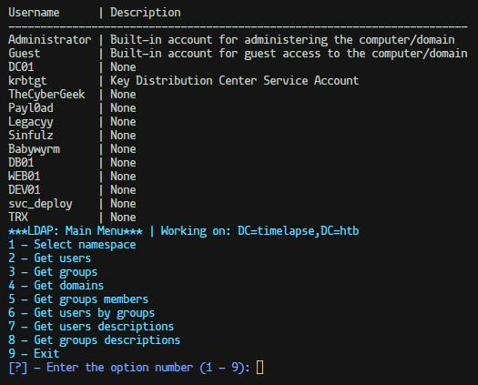

# AutoAD
## Introduction
This tool can assist you in the process of enumerating an Active Directory environment, allowing you to gather useful information easily without complex commands

## Index
0. [Features](#Features)
1. [Usage](#Usage)
    2. [LDAP](#LDAP)


## Features
### LDAP
- Get Users
- Get Groups
- Get Domains
- Get Group Members
- Get Users by Groups
- User Descriptions
- Get Group Descriptions


## Usage
- Null Session example
```bash
python3 autoAD.py IP/Domain
```
- Logged session example
```bash
python3 autoAD.py IP/Domain -u "username" -p "password"
```
### LDAP
- View Sample
